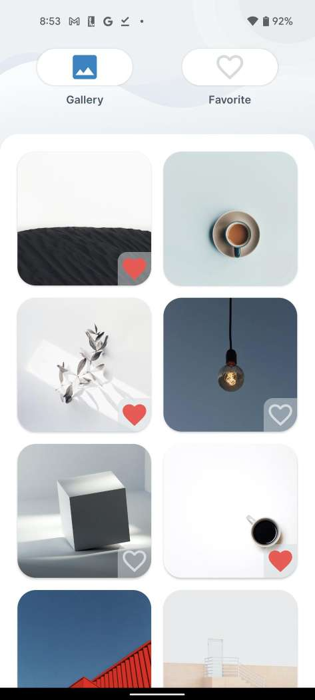

# Galleriez

  

## Requirements

- [x] View all pictures/video in phone storage.
- [x] Mark a picture/video as favorite.

## What's under the hood

- Pagination to avoid `OOM` when loading all photos/videos at once. (Adjustable in code)
- `DiffUtil` and `AsyncListDiffer` for background loading of large lists and to update only payloads that changed.
- Reactive programming using `Coroutines` and `Flow`
- Clean architecture with `MVI` pattern
- Follow and self-implemented `DI` principle

